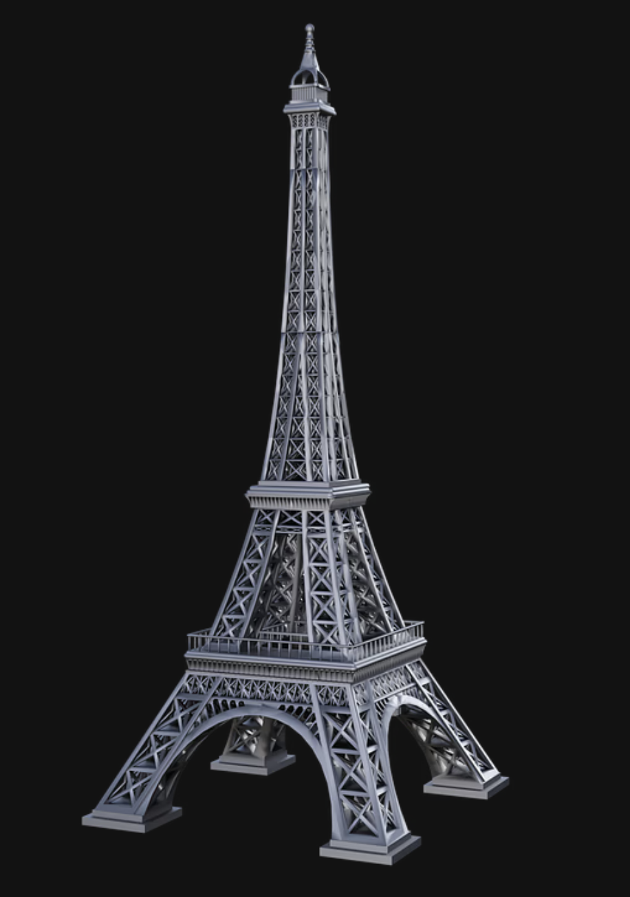

<!DOCTYPE html>
<html lang="en">
<head>
  <meta charset="UTF-8">
  <meta name="viewport" content="width=device-width, initial-scale=1.0">
  <meta http-equiv="X-UA-Compatible" content="ie=edge">
  <meta name="description" content="Andrey Levushkin - Digital Artist & NFT Creator. Explore my unique NFT collection and reach out for inquiries.">
  <meta name="keywords" content="Andrey Levushkin, NFT, Digital Art, Portfolio, Blockchain Art">
  <meta property="og:title" content="Levushkin NFTs - Portfolio">
  <meta property="og:description" content="Explore my unique NFT collection. Digital art powered by blockchain technology.">
  <meta property="og:image" content="link_to_image.jpg">
  <title>Levushkin NFTs - Portfolio</title>
  <link rel="stylesheet" href="styles.css">
  <link href="https://fonts.googleapis.com/css2?family=Poppins:wght@300;400;600&display=swap" rel="stylesheet">
</head>
<body>
  <!-- HEADER -->
  <header>
    

      <h1>Andrey Levushkin</h1>
      
Digital Artist & NFT Creator

      <nav>
        <a href="#about">About</a>
        <a href="#nft-gallery">NFT Gallery</a>
        <a href="#contact">Contact</a>
      </nav>
    

  </header>

  <!-- ABOUT SECTION -->
<section id="about">
  

    <h2>About Me</h2>
    
I'm Andrey Levushkin, a digital artist, and NFT creator with a passion for blending modern art with blockchain technology. My journey into the world of NFTs began with a vision to create art that isn't just visually striking but also meaningful in the decentralized world. I combine traditional artistry with digital elements, creating a fusion that speaks to the present and future of art.

    
    <h3>My Artistic Vision</h3>
    
Every NFT I create is a representation of the world as I see it—a balance of chaos, harmony, and growth. The use of blockchain not only ensures the authenticity of each piece but also provides my collectors with exclusive access to unlockable content, making each purchase even more valuable.

    
    <h3>Unlockable Content</h3>
    
Each of my NFTs comes with a special feature—a layer of unlockable content. This exclusive content can include high-res images, behind-the-scenes creation videos, or even personal messages to the buyer. It’s a unique experience for every collector who holds my NFTs, making them more than just a piece of art, but a part of a shared journey.

  

</section>

  <!-- NFT GALLERY -->
  <section id="nft-gallery">
    

      <h2>My NFT Collection</h2>
      

        

          
          
Next Generation: A Guide to Financial Success

          <a href="https://opensea.io/assets/ethereum/0x495f947276749ce646f68ac8c248420045cb7b5e/100782291747232641963229273805244904868544924327059616559895021881054654891095" target="_blank">View on OpenSea</a>
        

        

          
          
Never Give Up Hope: Financial Stability Guide

          <a href="https://opensea.io/assets/ethereum/0x495f947276749ce646f68ac8c248420045cb7b5e/100782291747232641963229273805244904868544924327059616559895021892049771168855" target="_blank">View on OpenSea</a>
        

      

    

  </section>

  <!-- CONTACT SECTION -->
  <section id="contact">
    

      <h2>Contact</h2>
      
Interested in my work or have any questions? Feel free to reach out to me!

      
      <!-- Contact Form -->
      <form action="submit_form.php" method="POST" class="contact-form">
        <input type="text" name="name" placeholder="Your Name" required>
        <input type="email" name="email" placeholder="Your Email" required>
        <textarea name="message" placeholder="Your Message" required></textarea>
        <button type="submit">Send Message</button>
      </form>
      
      <ul>
        <li>Email: <a href="mailto:andrey@levushkinNFTs.com">andrey@levushkinNFTs.com</a></li>
        <li>Twitter: <a href="https://twitter.com/levushkinNFTs" target="_blank">@levushkinNFTs</a></li>
        <li>Discord: <a href="https://discord.com/andreylevushkin" target="_blank">Andrey Levushkin's Discord</a></li>
      </ul>
    

  </section>

  <!-- FOOTER -->
  <footer>
    
&copy; 2023 Andrey Levushkin | All Rights Reserved

  </footer>

  
</body>
</html>

