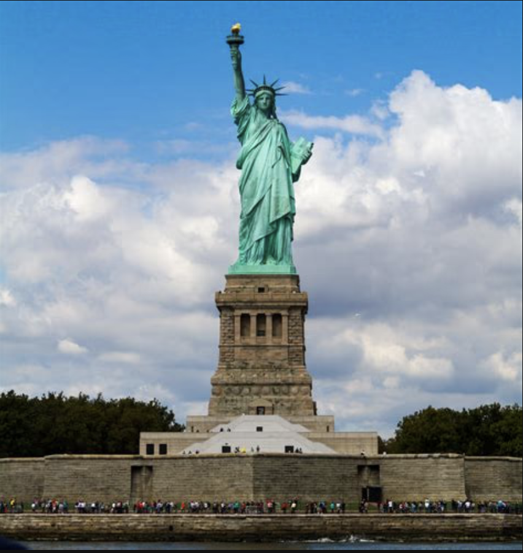
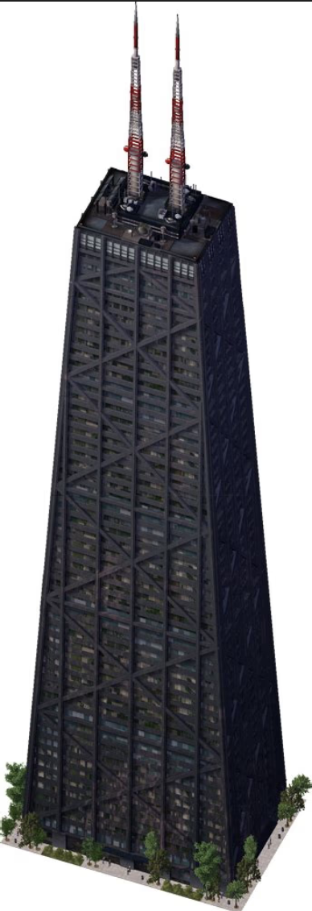
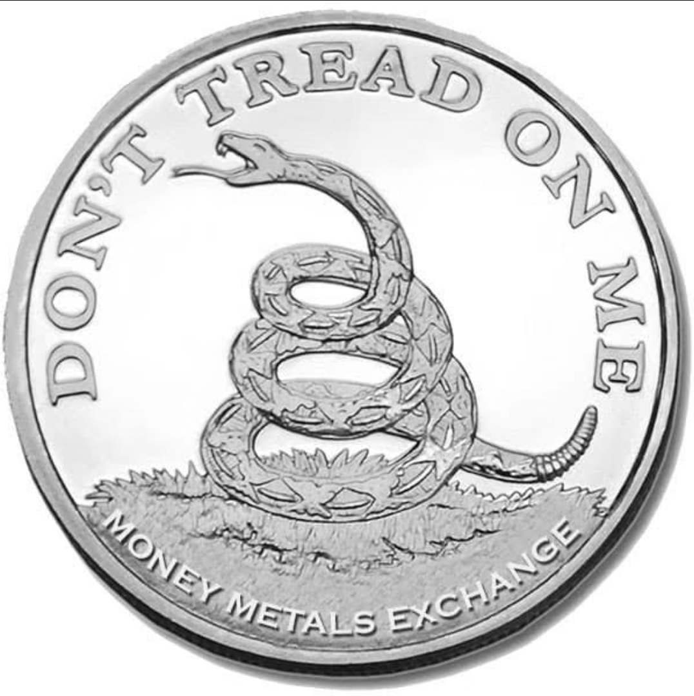

<html lang="en">
<head>
  <meta charset="UTF-8">
  <meta name="viewport" content="width=device-width, initial-scale=1.0">
  <title>Next Generation Investment Group</title>
  <link rel="stylesheet" href="styles.css">
</head>
<body>

  <!-- Language Selector (Top Right Corner) -->
  

<!-- HEADER -->
<header>
    

        <h1>Next Generation Investment Group</h1>
        
Your Future, Our Investment

        <nav>
            <a href="#about">About</a>
            <a href="#nft-gallery">NFT Gallery</a>
            <a href="#contact">Contact</a>
            <a href="https://your-next-gen-books-page.com" target="_blank">Next Generation Books</a> <!-- Opens in New Tab -->
        </nav>
    

  </header>

  <!-- JavaScript for Google Translate -->
  
  

</body>
</html>

<html lang="en">
<head>
  <meta charset="UTF-8">
  <meta name="viewport" content="width=device-width, initial-scale=1.0">
  <meta http-equiv="X-UA-Compatible" content="ie=edge">
  <meta name="description" content="Andrey Levushkin - Digital Artist & NFT Creator. Explore my unique NFT collection and reach out for inquiries.">
  <meta name="keywords" content="Andrey Levushkin, NFT, Digital Art, Portfolio, Blockchain Art">
  <meta property="og:title" content="Levushkin NFTs - Portfolio">
  <meta property="og:description" content="Explore my unique NFT collection. Digital art powered by blockchain technology.">
  <meta property="og:image" content="link_to_image.jpg">
  <title>Next Generation - Portfolio</title>
  <link rel="stylesheet" href="styles.css">
  <link href="https://fonts.googleapis.com/css2?family=Poppins:wght@300;400;600&display=swap" rel="stylesheet">
</head>
<body>

<html lang="en">
<head>
    <meta charset="UTF-8">
    <meta name="viewport" content="width=device-width, initial-scale=1.0">
    <title>Andrey Levushkin - Digital Artist & NFT Creator</title>
    <link rel="stylesheet" href="styles.css">
</head>
<body>

   
    <header>
        

            <h1>Andrey Levushkin</h1>
            
Digital Artist & NFT Creator

        

    

    <!-- ABOUT SECTION -->
    <section id="about">
        

            <h2>About Me</h2>
            
I'm <strong>Andrey Levushkin</strong>, a digital artist and NFT creator with a passion for blending modern art with blockchain technology. 
            My journey into the world of NFTs began with a vision to create art that isn't just visually striking but also meaningful in the decentralized world. 
            I combine traditional artistry with digital elements, creating a fusion that speaks to the present and future of art.

        

    </section>

    <!-- ARTISTIC VISION -->
    <section id="vision">
        

            <h2>My Artistic Vision</h2>
            
Every NFT I create is a representation of the world as I see it—a balance of chaos, harmony, and growth. 
            The use of blockchain not only ensures the authenticity of each piece but also provides my collectors with exclusive access to unlockable content, 
            making each purchase even more valuable.

        

    </section>

  
   <!-- UNLOCKABLE CONTENT -->
<section id="unlockable">
    

        <h2>Unlock Exclusive NFT Content</h2>
        
Investing in our NFTs goes beyond digital ownership—each piece includes **unlockable content** that provides a deeper, more immersive experience. 
        This special content is accessible only to NFT holders and can include:

        <ul>
            <li>High-resolution artwork and concept sketches.</li>
            <li>Behind-the-scenes creation videos and artist commentary.</li>
            <li>Exclusive personal messages or signed digital certificates.</li>
            <li>Bonus digital assets, such as additional artwork, music, or hidden features.</li>
        </ul>

        
Owning one of our NFTs means you're not just acquiring a collectible—you’re gaining access to **exclusive perks and content** that enhance the value of your investment.

        <h3>Explore Our Collections</h3>
        
Discover and invest in our unique NFT collections on OpenSea:

        <ul>
            <li><a href="https://opensea.io/JennerKendall" target="_blank">Jenner Kendall Collection</a></li>
            
            <li><a href="https://opensea.io/LevushkinAndreyVyacheslavovich" target="_blank">Levushkin Andrey Vyacheslavovich Collection</a></li>
            <li><a href="https://opensea.io/Tailgatee" target="_blank">Tailgatee Collection</a></li>
       
            <li><a href="https://opensea.io/StroyK">StroyK Collection</a></li>
      
            <li><a href="https://opensea.io/ToCold">ToCold Collection</a></li>
      
            <li><a href="https://opensea.io/MikeTysonGerard">MikeTysonGerard Collection</a></li>
        
            <li><a href="https://opensea.io/JaGood">JaGood Collection</a></li>
    
            <li><a href="https://opensea.io/MustafaSandall">MustafaSandall Collection</a></li>
       
            <li><a href="https://opensea.io/Hapku-Do">Hapku-Do Collection</a></li>

            
       

        
        
Unlock the future of digital ownership today. Invest in an NFT that offers more than just visual appeal—it comes with real, exclusive benefits.

    <!-- NEXT GENERATION COIN SECTION -->
<section id="next-gen-coin">
    

        <h2>Invest in Next Generation Coin</h2>
        
<strong>Next Generation Coin</strong> is a revolutionary investment opportunity in the blockchain space, offering unique benefits to its holders.

        <h3>Why Invest?</h3>
        <ul>
            <li><strong>Innovative Utility:</strong> Backed by real digital assets, including NFT books and exclusive content.</li>
            <li><strong>Long-term Growth:</strong> The coin is designed for scalability and increasing value over time.</li>
            <li><strong>Rewards for Holders:</strong> Every 3 months, the <strong>top 10 holders</strong> receive <strong>free next-generation books</strong>.</li>
            <li><strong>Dividends for Stakeholders:</strong> All stakeholders receive **exclusive free NFTs** every 3 months as part of the reward system.</li>
        </ul>

        <h3>How to Get Started?</h3>
        
Investing in Next Generation Coin is simple. Check out the official token details on 
        <a href="https://bscscan.com/token/0xa4612fa467129239b89e53cf788139d087e54066" target="_blank">BscScan</a> and start today.

        
Don’t miss out on this opportunity—be part of the future of decentralized publishing!

    

</section>

<!-- INVESTMENT SECTION -->
<section id="investment">
    

        <h2>Why Should You Invest in Next-Generation Books?</h2>
        
Investing in next-generation books, especially in digital, NFT-based, or AI-enhanced formats, can be a profitable and forward-thinking decision. Here’s why:

        <h3>1. The Future of Publishing is Digital & Decentralized</h3>
        <ul>
            <li>Traditional books are evolving into NFTs, interactive eBooks, and AI-generated storytelling.</li>
            <li>Blockchain technology ensures authenticity, rarity, and ownership verification.</li>
            <li>Resale & royalties: NFT books allow authors and investors to earn passive income through secondary market resales.</li>
        </ul>
        
<strong>Example:</strong> An NFT book could grant exclusive access to an author's future works, special editions, or even live discussions.

        <h3>2. Limited-Edition Books Increase in Value</h3>
        <ul>
            <li>Books released as limited digital collectibles (NFTs) gain value over time.</li>
            <li>Unique editions with unlockable content (bonus chapters, author notes, audiobooks) make them more desirable to collectors.</li>
            <li>Scarcity drives demand—just like rare first-edition physical books.</li>
        </ul>
        
<strong>Example:</strong> Think of first-edition Harry Potter books—some now sell for $50,000+. Next-gen books could be the digital equivalent.

        <h3>3. Passive Income & Royalties for Investors</h3>
        <ul>
            <li>Smart contracts ensure automatic royalties every time a book is resold.</li>
            <li>Unlike traditional publishing, where authors and investors earn only once, NFT books generate revenue indefinitely.</li>
            <li>Subscription-based ownership: Some NFT books grant lifetime access to new content or updates.</li>
        </ul>
        
<strong>Example:</strong> Holding a special-edition book NFT could unlock future books for free or at discounted prices.

        <h3>4. AI-Powered Books & Personalized Reading</h3>
        <ul>
            <li>AI is transforming books into interactive, customizable reading experiences.</li>
            <li>Imagine a personalized story where AI adjusts the plot based on your choices.</li>
            <li>AI-generated audiobooks can speak in multiple voices, adapting to characters and emotions.</li>
        </ul>
        
<strong>This technology has the potential to revolutionize storytelling—and early investors will be at the forefront of this change.</strong>

        <h3>5. Next-Gen Books Are a Cultural Shift</h3>
        <ul>
            <li>Readers are shifting towards immersive, multimedia, and gamified books.</li>
            <li>Future books could integrate VR & AR elements, offering experiences instead of just traditional reading.</li>
            <li>Owning a next-gen book NFT could be like owning a piece of history—similar to owning a rare first edition in the past.</li>
        </ul>

        <h3>Final Thoughts: Should You Invest?</h3>
        <ul>
            <li><strong>YES</strong>—If you believe in the future of digital ownership and limited-edition content.</li>
            <li><strong>YES</strong>—If you want passive income from resales and royalties.</li>
            <li><strong>YES</strong>—If you see books as a cultural shift, not just a product.</li>
        </ul>
        
Books are evolving—smart investors and collectors are already entering the market early.

        
If you’d like recommendations on where to buy or invest in next-gen books, please don’t hesitate to reach out to us.

    

</section>

<!-- GET STARTED SECTION -->
<section id="get-started">
    

        <h2>How to Get Started with Us</h2>
        
Follow these simple steps to set up your wallet and start investing in exclusive NFTs and digital assets.

        <h3>Step 1: Set Up a Crypto Wallet</h3>
        
To buy and store NFTs, you need a crypto wallet. We recommend using:

        <ul>
            <li><a href="https://metamask.io/" target="_blank">MetaMask</a> (Browser Extension & Mobile App)</li>
            <li><a href="https://trustwallet.com/" target="_blank">Trust Wallet</a> (Mobile App)</li>
            <li><a href="https://www.coinbase.com/wallet" target="_blank">Coinbase Wallet</a></li>
        </ul>
        
<strong>How to Install MetaMask:</strong>

        <ol>
            <li>Go to <a href="https://metamask.io/" target="_blank">MetaMask</a> and click "Download".</li>
            <li>Install the extension for your browser or the mobile app.</li>
            <li>Create a new wallet and securely store your recovery phrase.</li>
            <li>Add Binance Smart Chain (BSC) or Ethereum Network in wallet settings.</li>
        </ol>

        <h3>Step 2: Fund Your Wallet</h3>
        
To buy NFTs, you need cryptocurrency. You can buy crypto from:

        <ul>
            <li><a href="https://www.binance.com/" target="_blank">Binance</a></li>
            <li><a href="https://www.coinbase.com/" target="_blank">Coinbase</a></li>
            <li><a href="https://www.bybit.com/invite?ref=NL6ZN7" target="_blank">ByBit</a></li>
        </ul>
        
Once you purchase crypto (ETH or BNB), transfer it to your wallet address.

        <h3>Step 3: Connect to an NFT Marketplace</h3>
        
Now, you can browse and buy exclusive NFTs from our collections:

        <ul>
             <li><a href="https://opensea.io/JennerKendall" target="_blank">Jenner Kendall Collection</a></li>
            
             <li><a href="https://opensea.io/LevushkinAndreyVyacheslavovich" target="_blank">Levushkin Andrey Vyacheslavovich Collection</a></li>
             <li><a href="https://opensea.io/Tailgatee" target="_blank">Tailgatee Collection</a></li>
            
             <li><a href="https://opensea.io/StroyK">StroyK Collection</a></li>
      
             <li><a href="https://opensea.io/ToCold">ToCold Collection</a></li>
      
             <li><a href="https://opensea.io/MikeTysonGerard">MikeTysonGerard Collection</a></li>
        
             <li><a href="https://opensea.io/JaGood">JaGood Collection</a></li>
    
             <li><a href="https://opensea.io/MustafaSandall">MustafaSandall Collection</a></li>
       
             <li><a href="https://opensea.io/Hapku-Do">Hapku-Do Collection</a></li>
       
        </ul>

            
        
To buy an NFT, connect your wallet to OpenSea and complete your purchase.

        
<strong>How to Trade P2P:</strong>

        <ol>
            <li>Find a trusted buyer or seller in our <a href="https://t.me/levushkinAndrey" target="_blank">Contac me on Telegram</a>.</li>
            <li>Use a smart contract or escrow service for safe transactions.</li>
            <li>Agree on the price and confirm the trade through your wallet.</li>
        </ol>
        
P2P trading gives you full control over your assets and potential profit.

        <h3>Step 4: Start Earning with NFTs</h3>
        
By holding our NFTs, you unlock:

        <ul>
            <li>Exclusive digital content & unlockable rewards.</li>
            <li>Royalties from resale transactions.</li>
            <li>Opportunities to stake NFTs for passive income.</li>
        </ul>
        
Join the future of digital ownership today!

    

</section>

        <h3>Step 5: Start Investing & Earning</h3>
        
By holding our NFTs, you gain access to:

        <ul>
            <li>Exclusive digital content & unlockable rewards.</li>
            <li>Royalties from resale transactions.</li>
            <li>Opportunities to stake NFTs for passive income.</li>
        </ul>
        
Join the future of digital ownership today!

    

 <!-- NFT GALLERY -->

<section id="nft-gallery">
  

    <h2>My NFT Collection</h2>
    

      

        

  

  
Кремль

        <a href="https://opensea.io/assets/ethereum/0x495f947276749ce646f68ac8c248420045cb7b5e/100782291747232641963229273805244904868544924327059616559895022266983236239361/" target="_blank">View on OpenSea</a>
        

<section id="nft-gallery">
  

    <h2>My NFT Collection</h2>
    

      

        

  

  
Eiffel tower

        <a href="https://opensea.io/assets/ethereum/0x495f947276749ce646f68ac8c248420045cb7b5e/100782291747232641963229273805244904868544924327059616559895021881054654891095" target="_blank">View on OpenSea</a>
     
      
      
          <section id="nft-gallery">
  

    <h2></h2>
      

         

        

  

        
Next Generation: A Comprehensive Guide to Building Wealth and Securing Your Financial Future

        <a href="https://opensea.io/assets/ethereum/0x495f947276749ce646f68ac8c248420045cb7b5e/100782291747232641963229273805244904868544924327059616559895021892049771168855" target="_blank">View on OpenSea</a>

        <section id="nft-gallery">
  

    <h2></h2>
    

      

        

  

  
“永不放弃希望：现代世界金融稳定全面指南”

        <a href="https://opensea.io/assets/ethereum/0x495f947276749ce646f68ac8c248420045cb7b5e/100782291747232641963229273805244904868544924327059616559895021892049771168855/" target="_blank">View on OpenSea</a>
      

    

  

</section>

<section id="nft-gallery">
  

    <h2></h2>
    

      

        

  

  
“G-Wagon”

        <a href="https://opensea.io/assets/ethereum/0x495f947276749ce646f68ac8c248420045cb7b5e/100782291747232641963229273805244904868544924327059616559895021892049771168855/" target="_blank">View on OpenSea</a>
      

    

  

</section>

<section id="nft-gallery">
  

    <h2></h2>
    

      

        

  

  
“РОССИЯ”

  <a href="https://opensea.io/assets/ethereum/0x495f947276749ce646f68ac8c248420045cb7b5e/100782291747232641963229273805244904868544924327059616559895022128444771139585/" target="_blank">View on OpenSea</a>
      

    

  

</section>

<section id="nft-gallery">
  

    <h2></h2>
    

      

        

  

  
“🪙”

        <a href="https://opensea.io/assets/matic/0x2953399124f0cbb46d2cbacd8a89cf0599974963/59504699225704685389362227968250830728831028033868499256789113012756223624167/" target="_blank">View on OpenSea</a>
      

    

  

</section>

<section id="nft-gallery">
  

    <h2></h2>
    

      

        

  

  
“Top Quartile Operating Capabilitie¢”

        <a href="https://opensea.io/assets/ethereum/0x495f947276749ce646f68ac8c248420045cb7b5e/100782291747232641963229273805244904868544924327059616559895022197714003689475/" target="_blank">View on OpenSea</a>
      

    

  

</section>

<section id="nft-gallery">
  

    <h2></h2>
    

      

        

  

  
“ALFA ROMEO”

        <a href="https://opensea.io/assets/ethereum/0x495f947276749ce646f68ac8c248420045cb7b5e/31380740989087185115935912523040005008143984001746597795450580434158121648130/" target="_blank">View on OpenSea</a>
      

    

  

</section>

<section id="nft-gallery">
  

    <h2></h2>
    

      

        

  

  
“Airbus”

        <a href="https://opensea.io/assets/ethereum/0x495f947276749ce646f68ac8c248420045cb7b5e/59504699225704685389362227968250830728831028033868499256789113200772711972865/" target="_blank">View on OpenSea</a>
      

    

  

</section>

<section id="nft-gallery">
  

    <h2></h2>
    

      

        

  

  
“BMW M3 Coupe 1980”

        <a href="https://opensea.io/assets/ethereum/0x495f947276749ce646f68ac8c248420045cb7b5e/31380740989087185115935912523040005008143984001746597795450580383580586770434/" target="_blank">View on OpenSea</a>
      

    

  

</section>

<section id="nft-gallery">
  

    <h2></h2>
    

      

        

  

  
“USA”

       <a href="https://opensea.io/assets/ethereum/0x495f947276749ce646f68ac8c248420045cb7b5e/59504699225704685389362227968250830728831028033868499256789113012756223623169/" target="_blank">View on OpenSea</a>
      

    

  

</section>

<section id="nft-gallery">
  

    <h2></h2>
    

      

        

  

  
“United States Capitol”

        <a href="https://opensea.io/assets/ethereum/0x495f947276749ce646f68ac8c248420045cb7b5e/100782291747232641963229273805244904868544924327059616559895022214206678106113/" target="_blank">View on OpenSea</a>
      

    

  

</section>

<section id="nft-gallery">
  

    <h2></h2>
    

      

        

  

  
“Statue of Liberty”

        <a href="https://opensea.io/assets/ethereum/0x495f947276749ce646f68ac8c248420045cb7b5e/100782291747232641963229273805244904868544924327059616559895022290072980422657/" target="_blank">View on OpenSea</a>
      

    

  

</section>

<section id="nft-gallery">
  

    <h2></h2>
    

      

        

  

  
“875 N Michigan Ave (formerly the John Hancock Center)”

        <a href="https://opensea.io/assets/ethereum/0x495f947276749ce646f68ac8c248420045cb7b5e/100782291747232641963229273805244904868544924327059616559895022224102282756097/" target="_blank">View on OpenSea</a>
      

    

  

</section>

<section id="nft-gallery">
  

    <h2></h2>
    

      

        

  

  
“Chicago Bulls”

        <a href="https://opensea.io/assets/ethereum/0x495f947276749ce646f68ac8c248420045cb7b5e/111091691572410479027261683849172229110621282895288383611315321221068210831361/" target="_blank">View on OpenSea</a>
      

    

  

</section>

<section id="nft-gallery">
  

    <h2></h2>
    

      

        

  

  
“KHL”

       <a href="https://opensea.io/assets/ethereum/0x495f947276749ce646f68ac8c248420045cb7b5e/59504699225704685389362227968250830728831028033868499256789113013855735250996/" target="_blank">View on OpenSea</a>
      

    

  

</section>

<section id="nft-gallery">
  

    <h2></h2>
    

      

        

  

  
“UFC 1 BELT!”

        <a href="https://opensea.io/assets/ethereum/0x495f947276749ce646f68ac8c248420045cb7b5e/100782291747232641963229273805244904868544924327059616559895022182320840900609/" target="_blank">View on OpenSea</a>
      

    

  

</section>

<section id="nft-gallery">
  

    <h2></h2>
    

      

        

  

  
“💍”

        <a href="https://opensea.io/assets/ethereum/0x495f947276749ce646f68ac8c248420045cb7b5e/100782291747232641963229273805244904868544924327059616559895022448402654822452/" target="_blank">View on OpenSea</a>
      

    

  

</section>

<section id="nft-gallery">
  

    <h2></h2>
    

      

        

  

  
“Switzerland”

        <a href="https://opensea.io/assets/matic/0x2953399124f0cbb46d2cbacd8a89cf0599974963/31380740989087185115935912523040005008143984001746597795450580331903540264961/" target="_blank">View on OpenSea</a>
      

    

  

</section>

<section id="nft-gallery">
  

    <h2></h2>
    

      

        

  

  
“Silver Coins”

        <a href="https://opensea.io/assets/matic/0x2953399124f0cbb46d2cbacd8a89cf0599974963/59504699225704685389362227968250830728831028033868499256789113011656712095391/" target="_blank">View on OpenSea</a>
      

    

  

</section>

<section id="nft-gallery">
  

    <h2></h2>
    

      

        

  

  
“🇮🇪"Табhair dom do lámh agus do chroí"”

        <a href="https://opensea.io/assets/ethereum/0x495f947276749ce646f68ac8c248420045cb7b5e/59504699225704685389362227968250830728831028033868499256789113120508363145217/" target="_blank">View on OpenSea</a>
      

    

  

</section>

<section id="nft-gallery">
  

    <h2></h2>
    

      

        

  

  
“This is me !”

        <a href="https://opensea.io/assets/matic/0xe53fee12be051a45bc28296f7bce5ea199a48eba/8/" target="_blank">View on OpenSea</a>
      

    

  

</section>

<section id="nft-gallery">
  

    <h2></h2>
    

      

        

  

  
“Ship”

        <a href="https://opensea.io/assets/ethereum/0x495f947276749ce646f68ac8c248420045cb7b5e/31380740989087185115935912523040005008143984001746597795450580440755191414785/" target="_blank">View on OpenSea</a>
      

    

  

</section>

<section id="nft-gallery">
  

    <h2></h2>
    

      

        

  

  
“Golden Gates”

        <a href="https://opensea.io/assets/ethereum/0x495f947276749ce646f68ac8c248420045cb7b5e/91775483070528057166775215885800191664849308017105384806622015955500563169281/" target="_blank">View on OpenSea</a>
      

    

  

</section>

<section id="nft-gallery">
  

    <h2></h2>
    

      

        

  

  
“Moon”

        <a href="https://opensea.io/assets/ethereum/0x495f947276749ce646f68ac8c248420045cb7b5e/100782291747232641963229273805244904868544924327059616559895022412118771105793/" target="_blank">View on OpenSea</a>
      

    

  

</section>

<section id="nft-gallery">
  

    <h2></h2>
    

      

        

  

  
“https://www.mancity.com/”

        <a href="https://opensea.io/assets/ethereum/0x495f947276749ce646f68ac8c248420045cb7b5e/100782291747232641963229273805244904868544924327059616559895022324157840883713/" target="_blank">View on OpenSea</a>
      

    

  

</section>

<section id="nft-gallery">
  

    <h2></h2>
    

      

        

  

  
“Gold coins”

        <a href="https://opensea.io/assets/ethereum/0x495f947276749ce646f68ac8c248420045cb7b5e/59504699225704685389362227968250830728831028033868499256789113221663432950102/" target="_blank">View on OpenSea</a>
      

    

  

</section>

<section id="nft-gallery">
  

    <h2></h2>
    

      

        

  

  
“Male”

        <a href="https://opensea.io/assets/ethereum/0x495f947276749ce646f68ac8c248420045cb7b5e/75519733618304296855578221943523409658140484639423646347431477005179863171073/" target="_blank">View on OpenSea</a>
      

    

  

</section>

<section id="nft-gallery">
  

    <h2></h2>
    

      

        

  

  
“Louis 🎒”

        <a href="https://opensea.io/assets/ethereum/0x495f947276749ce646f68ac8c248420045cb7b5e/100782291747232641963229273805244904868544924327059616559895022029488724639757/" target="_blank">View on OpenSea</a>
      

    

  

</section>

<section id="nft-gallery">
  

    <h2></h2>
    

      

        

  

  
“206.2”

        <a href="https://opensea.io/assets/ethereum/0x495f947276749ce646f68ac8c248420045cb7b5e/6391311083767696706713078133338739597420264063527889527264414292797240115201/" target="_blank">View on OpenSea</a>
      

    

  

</section>

<section id="nft-gallery">
  

    <h2></h2>
    

      

        

  

  
“10X”

        <a href="https://opensea.io/assets/matic/0x2953399124f0cbb46d2cbacd8a89cf0599974963/6391311083767696706713078133338739597420264063527889527264414247717263376431/" target="_blank">View on OpenSea</a>
      

    

  

</section>

<section id="nft-gallery">
  

    <h2></h2>
    

      

        

  

  
“Silver Coins”

        <a href="https://opensea.io/assets/matic/0x2953399124f0cbb46d2cbacd8a89cf0599974963/59504699225704685389362227968250830728831028033868499256789113010557200467615/" target="_blank">View on OpenSea</a>
      

    

  

</section>

<section id="nft-gallery">
  

    <h2></h2>
    

      

        

  

  
“NBA”

        <a href="https://opensea.io/assets/ethereum/0x495f947276749ce646f68ac8c248420045cb7b5e/100782291747232641963229273805244904868544924327059616559895021904144399073281/" target="_blank">View on OpenSea</a>
      

    

  

</section>

<section id="nft-gallery">
  

    <h2></h2>
    

      

        

  

  
“👽”

        <a href="https://opensea.io/assets/ethereum/0x495f947276749ce646f68ac8c248420045cb7b5e/100782291747232641963229273805244904868544924327059616559895022199913026945025/" target="_blank">View on OpenSea</a>
      

    

  

</section>

<section id="nft-gallery">
  

    <h2></h2>
    

      

        

  

  
“United Arab Emirates”

        <a href="https://opensea.io/assets/ethereum/0x495f947276749ce646f68ac8c248420045cb7b5e/100782291747232641963229273805244904868544924327059616559895022116350143234053/" target="_blank">View on OpenSea</a>
      

    

  

</section>

<section id="nft-gallery">
  

    <h2></h2>
    

      

        

  

  
“🌊”

        <a href="https://opensea.io/assets/ethereum/0x495f947276749ce646f68ac8c248420045cb7b5e/100782291747232641963229273805244904868544924327059616559895022310963701350401/" target="_blank">View on OpenSea</a>
      

    

  

</section>

<section id="nft-gallery">
  

    <h2></h2>
    

      

        

  

  
“Burj Khalifa”

        <a href="https://opensea.io/assets/ethereum/0x495f947276749ce646f68ac8c248420045cb7b5e/100782291747232641963229273805244904868544924327059616559895022334053445533697/" target="_blank">View on OpenSea</a>
      

    

  

</section>

<section id="nft-gallery">
  

    <h2></h2>
    

      

        

  

  
“🐩”

        <a href="https://opensea.io/assets/ethereum/0x495f947276749ce646f68ac8c248420045cb7b5e/59504699225704685389362227968250830728831028033868499256789113260146339872837/" target="_blank">View on OpenSea</a>
      

    

  

</section>

<section id="nft-gallery">
  

    <h2></h2>
    

      

        

  

  
“2023 GULFSTREAM G650ER”

        <a href="https://opensea.io/assets/ethereum/0x495f947276749ce646f68ac8c248420045cb7b5e/22690953294215810481915508425193418212827704754843760144674515432967690518529" target="_blank">View on OpenSea</a>
      

    

  

</section>

<section id="nft-gallery">
  

    <h2></h2>
    

      

        

  

  
“TESLA”

        <a href="https://opensea.io/assets/ethereum/0x495f947276749ce646f68ac8c248420045cb7b5e/100782291747232641963229273805244904868544924327059616559895022208709119967233/" target="_blank">View on OpenSea</a>
      

    

  

</section>

<section id="nft-gallery">
  

    <h2></h2>
    

      

        

  

  
“Mercedes-Benz”

        <a href="https://opensea.io/assets/ethereum/0x495f947276749ce646f68ac8c248420045cb7b5e/100782291747232641963229273805244904868544924327059616559895022321958817628161/" target="_blank">View on OpenSea</a>
      

    

  

</section>

<section id="nft-gallery">
  

    <h2></h2>
    

      

        

  

  
“Kamaz”

        <a href="https://opensea.io/assets/ethereum/0x495f947276749ce646f68ac8c248420045cb7b5e/75519733618304296855578221943523409658140484639423646347431476969995491082241/" target="_blank">View on OpenSea</a>
      

    

  

</section>

<section id="nft-gallery">
  

    <h2></h2>
    

      

        

  

  
“Автобус-Поезд”

        <a href="https://opensea.io/assets/ethereum/0x495f947276749ce646f68ac8c248420045cb7b5e/100782291747232641963229273805244904868544924327059616559895022371436840878090/" target="_blank">View on OpenSea</a>
      

    

  

</section>

<section id="nft-gallery">
  

    <h2></h2>
    

      

        

  

  
“TRX420”

        <a href="https://opensea.io/assets/matic/0x2953399124f0cbb46d2cbacd8a89cf0599974963/75519733618304296855578221943523409658140484639423646347431476960099886432257/" target="_blank">View on OpenSea</a>
      

    

  

</section>

<section id="nft-gallery">
  

    <h2></h2>
    

      

        

  

  
“BMW M3 E30 1987–1991”

        <a href="https://opensea.io/assets/ethereum/0x495f947276749ce646f68ac8c248420045cb7b5e/100782291747232641963229273805244904868544924327059616559895022194415468806145/" target="_blank">View on OpenSea</a>
      

    

  

</section>

<section id="nft-gallery">
  

    <h2></h2>
    

      

        

  

  
“912 Porshe”

        <a href="https://opensea.io/assets/ethereum/0x495f947276749ce646f68ac8c248420045cb7b5e/75519733618304296855578221943523409658140484639423646347431476997483281776641/" target="_blank">View on OpenSea</a>
      

    

  

</section>

<section id="nft-gallery">
  

    <h2></h2>
    

      

        

  

  
“M3 Touring”

        <a href="https://opensea.io/assets/ethereum/0x495f947276749ce646f68ac8c248420045cb7b5e/75519733618304296855578221943523409658140484639423646347431476999682305032193/" target="_blank">View on OpenSea</a>
      

    

  

</section>

<section id="nft-gallery">
  

    <h2></h2>
    

      

        

  

  
“718 Spider Rs”

        <a href="https://opensea.io/assets/matic/0x2953399124f0cbb46d2cbacd8a89cf0599974963/75519733618304296855578221943523409658140484639423646347431476952403305037825/" target="_blank">View on OpenSea</a>
      

    

  

</section>

<section id="nft-gallery">
  

    <h2></h2>
    

      

        

  

  
“Taycan Sport Turismo”

        <a href="https://opensea.io/assets/matic/0x2953399124f0cbb46d2cbacd8a89cf0599974963/75519733618304296855578221943523409658140484639423646347431476955701839921153/" target="_blank">View on OpenSea</a>
      

    

  

</section>

<section id="nft-gallery">
  

    <h2></h2>
    

      

        

  

  
“Eiffel tower”

        <a href="https://opensea.io/assets/ethereum/0x495f947276749ce646f68ac8c248420045cb7b5e/59504699225704685389362227968250830728831028033868499256789113090821549195265/" target="_blank">View on OpenSea</a>
      

    

  

</section>

<section id="nft-benefits">
    

        <h2>Benefits of Owning Our Unlockable NFTs</h2>

        <h3>1. Exclusive Unlockable Content</h3>
        
Each NFT grants access to hidden content, including:

        <ul>
            <li>High-resolution artwork and special editions</li>
            <li>Behind-the-scenes creation videos</li>
            <li>Exclusive books, music, or AI-generated content</li>
            <li>Personalized messages from the creator</li>
        </ul>

        <h3>2. Investment & Resale Opportunities</h3>
        
Our NFTs are limited-edition, making them valuable over time. Investors can:

        <ul>
            <li>Buy early and sell later for potential profit</li>
            <li>Trade NFTs on peer-to-peer (P2P) marketplaces</li>
            <li>Earn royalties on secondary sales</li>
        </ul>

        <h3>3. VIP Membership & Exclusive Access</h3>
        
Holding our NFTs gives you access to premium perks, such as:

        <ul>
            <li>Early access to future NFT drops</li>
            <li>Exclusive community events and collaborations</li>
            <li>Discounts and bonuses on upcoming releases</li>
        </ul>

        <h3>4. Passive Income & Utility</h3>
        
Our NFTs are more than just collectibles—they offer real utility:

        <ul>
            <li>Stake NFTs to earn rewards</li>
            <li>Access monetized content (ebooks, digital assets, courses)</li>
            <li>License NFT content for commercial use</li>
        </ul>

        <h3>5. P2P Trading & Collector Value</h3>
        
Trade NFTs directly with others on marketplaces like:

        <ul>
            <li><a href="https://opensea.io" target="_blank">OpenSea</a></li>
            <li><a href="https://blur.io" target="_blank">Blur</a></li>
            <li><a href="https://rarible.com" target="_blank">Rarible</a></li>
        </ul>
        
Bundle NFTs together or auction them for higher value!

        <h3>Start Investing Today!</h3>
        
Ready to benefit from unlockable NFTs? Explore our collection now:

        <ul>
            <li><a href="https://opensea.io/LevushkinAndreyVyacheslavovich" target="_blank">Levushkin Andrey Collection</a></li>
 

<!-- CONTACT SECTION -->
<section id="contact">
  

    <h2></h2>
    <ul>
      <li>Email: <a href="mailto:levka0091@gmail.com">levka0091@gmail.com</a></li>
      <li>Instagram: <a href="https://www.instagram.com/andrey_levushkin/" target="_blank">@andrey_levushkin</a></li>
      <li>Telegram: <a href="https://t.me/levushkinAndrey" target="_blank">@levushkinAndrey</a></li>
    </ul>
  

</section>

  <!-- FOOTER -->
  <footer>
    
&copy; 2022 Andrey Levushkin | All Rights Reserved

  </footer>

 

 
